<p align="center"></p>
<h1 align="center">ExpenseR</h1>
<p align="center"><strong>The Ultimate Financial Tracker for College Students Living in Dorms! 🍕📚🏡</strong></p>

<p align="center">
  
  
  
  
  
</p>

---

## 📖 Table of Contents
- [About ExpenseR](#about-expenser)
- [Key Features for Students](#key-features-for-students)
- [App Workflow & Screenshots](#app-workflow--screenshots)
- [Tech Stack](#tech-stack)
- [Design](#design)
- [Demo](#demo)
- [Installation & Setup](#installation--setup)
- [Project Structure](#project-structure)
- [Contributors](#contributors)

---

## 🎒 About ExpenseR
Managing a tight budget while living in a college dorm can be stressful. Between rent, groceries, late-night pizza runs, and expensive textbooks, it's easy to lose track of where your money is going. 

**ExpenseR** is a cross-platform financial management app built with Flutter and powered by Firebase, designed specifically to help college students track their daily expenses, set realistic budgets, and monitor their finances in real-time. With intuitive visual charts, secure cloud storage, and daily tracking, ExpenseR simplifies financial management so you can focus on your studies (and your social life) without breaking the bank!

---

## ✨ Key Features for Students
- **Real-Time Data Syncing**: Log an expense on your phone while at the grocery store, and see it instantly reflected on your laptop via secure Firebase cloud storage.
- **Visual Budget Analytics**: Understand your spending habits at a glance with beautiful pie charts and bar graphs. See exactly how much went to "Study Snacks" vs. "Textbooks".
- **Multi-Currency Support**: Perfect for international students. Set your local currency effortlessly.
- **Intuitive Categories**: Categorize your expenses dynamically so you know exactly where to cut back at the end of the semester.
- **Secure Authentication**: Keep your financial data private with Email/Password and Google Sign-In options.

---

## 📱 App Workflow & Screenshots

Take a look at the ExpenseR user journey. Screenshots are grouped by feature so the flow is clear and easy to scan.

### 1. Onboarding
> First-time users are welcomed with a guided introduction to ExpenseR and its main benefits.

<p align="center">
  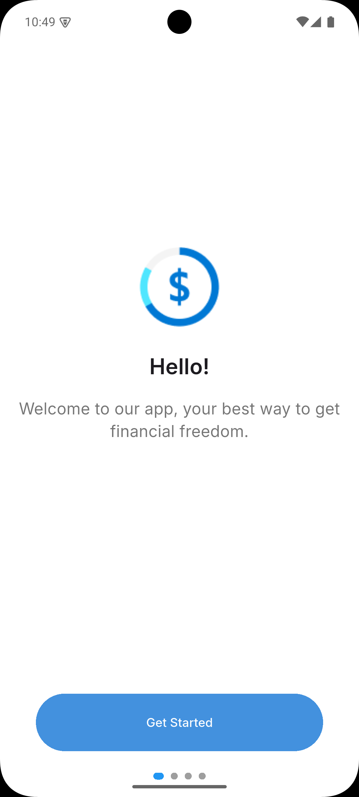
  &nbsp;&nbsp;&nbsp;
  
  &nbsp;&nbsp;&nbsp;
  
</p>

### 2. Authentication (Sign In & Sign Up)
> Secure login and registration with a clean, student-friendly interface.

<p align="center">
  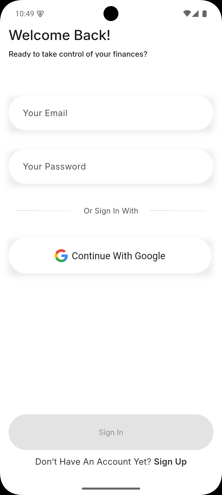
  &nbsp;&nbsp;&nbsp;
  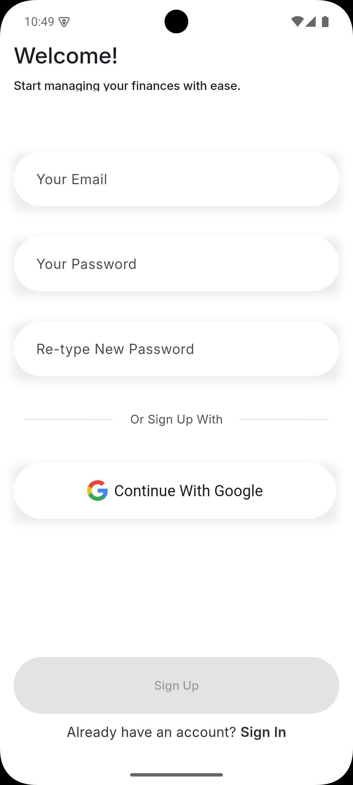
</p>

### 3. Home Dashboard
> The command center: see current balance, quick insights, and recent activity at a glance.

<p align="center">
  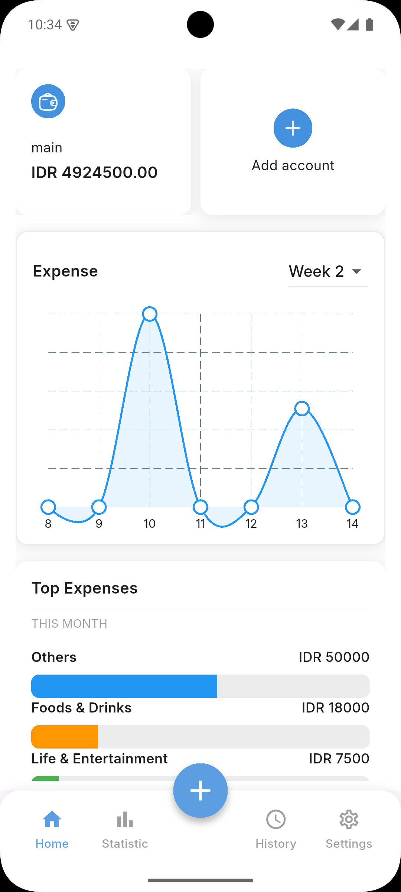
</p>

### 4. Record Transaction
> Quickly add a new expense or income with structured steps: amount, category, date, and extra details when needed.

<p align="center">
  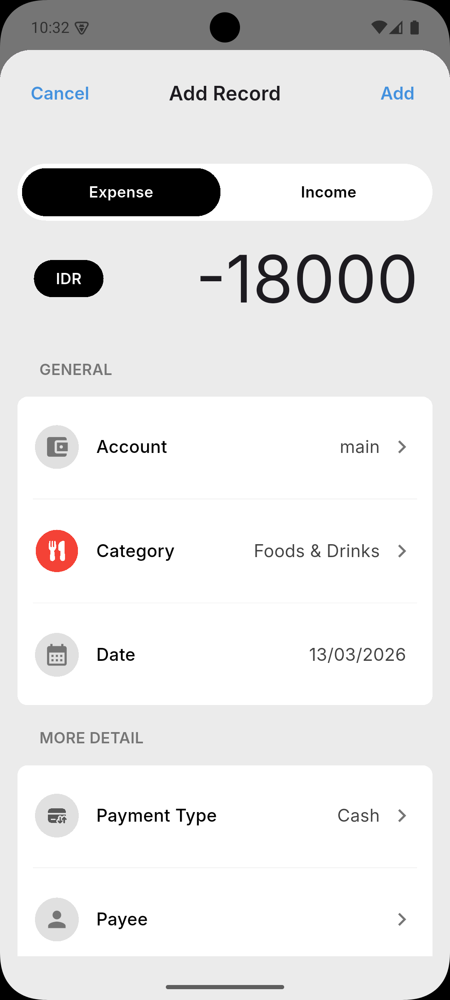
  &nbsp;&nbsp;&nbsp;
  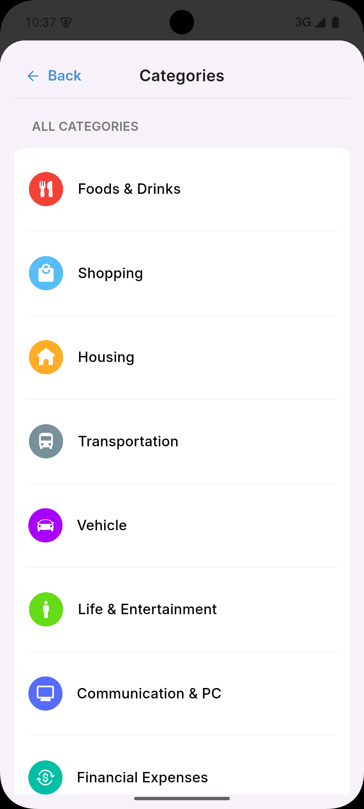
  &nbsp;&nbsp;&nbsp;
  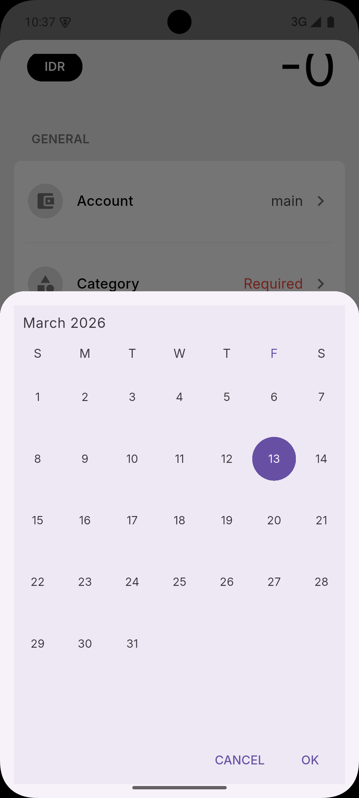
</p>

<p align="center">
  
  &nbsp;&nbsp;&nbsp;
  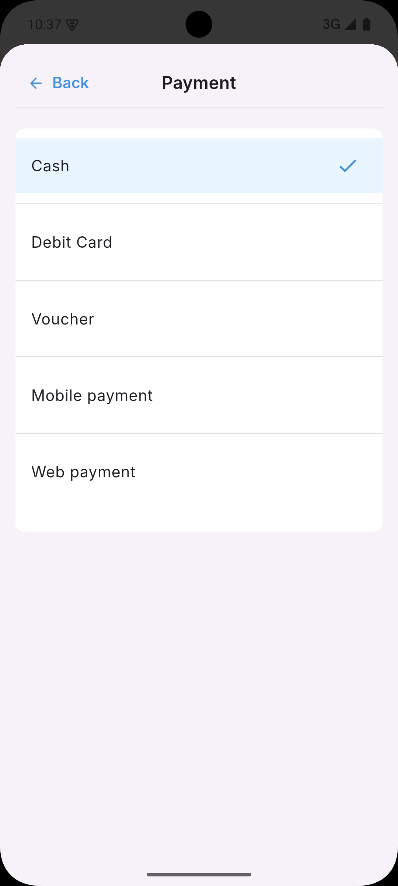
  &nbsp;&nbsp;&nbsp;
  
</p>

### 5. History & Analytics
> Review your past activity and understand spending patterns with clear visualizations.

<p align="center">
  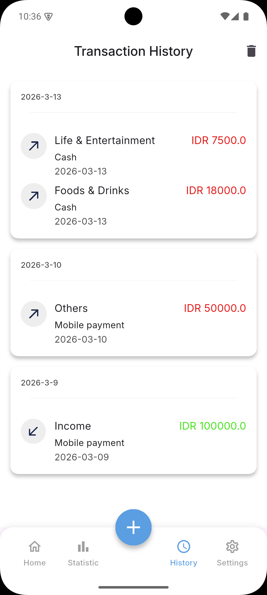
  &nbsp;&nbsp;&nbsp;
  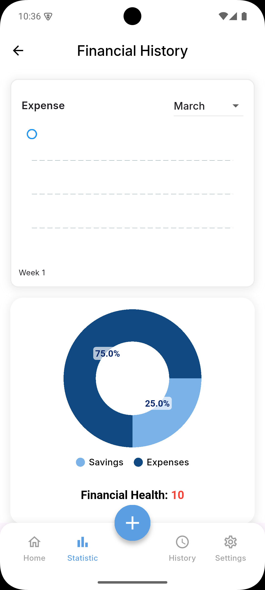
  &nbsp;&nbsp;&nbsp;
  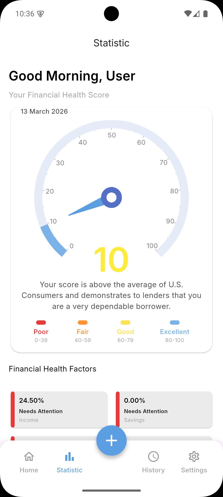
</p>

### 6. Settings
> Adjust preferences, manage account-related options, and keep your profile up-to-date.

<p align="center">
  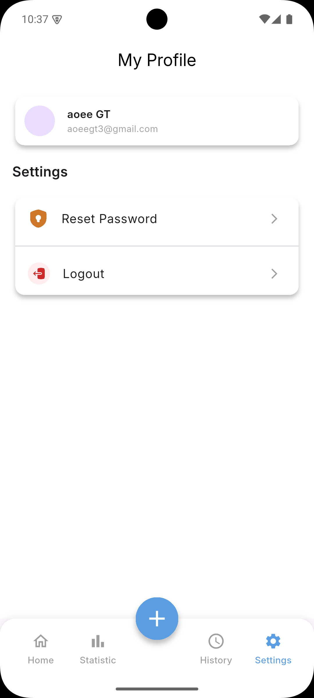
</p>

---

## 🛠 Tech Stack

**Frontend Framework & Languages:**
<br>
<a href="https://dart.dev/"></a>
<a href="https://flutter.dev/"></a>

**Backend & Cloud Services:**
<br>
<a href="https://firebase.google.com/"></a>
- **Firebase Auth**: Secure user authentication (Email/Password & Google Sign-In).
- **Cloud Firestore**: Real-time NoSQL database for syncing user transactions securely.

**Key Libraries & Packages:**
- `provider`: State management.
- `fl_chart` & `pie_chart`: Interactive and beautiful data visualization.
- `flutter_secure_storage` & `shared_preferences`: Local secure data caching.
- `syncfusion_flutter_gauges` & `syncfusion_flutter_datepicker`: Advanced UI components.
- `currency_picker`: Easy multi-currency setup.

---

## 🎨 Design

Figma: <a href="https://www.figma.com/design/4enL2toOi9tpkYEUtTfnim/ExpenseR?node-id=6-300&t=oFj0DCD1RreUE9vo-1">ExpenseR Design</a>

---

## 🎥 Demo

Demonstration Video: <a href="https://drive.google.com/file/d/1PDzRoHcNOZC2cZnaRRJjFVGoSu8Y2GN_/view?usp=drive_link">ExpenseR Demo</a>

---

## 🚀 Installation & Setup

Want to run ExpenseR locally? Follow these steps:

1. **Clone the repository:**
   ```bash
   git clone https://github.com/yourusername/ExpenseR.git
   cd ExpenseR
   ```

2. **Install Flutter dependencies:**
   ```bash
   flutter pub get
   ```

3. **Firebase Configuration:**
   - Create a project on the [Firebase Console](https://console.firebase.google.com/).
   - Enable **Authentication** (Email/Password & Google) and **Firestore Database**.
   - Use the `flutterfire cli` to configure the project, which will generate `lib/firebase_options.dart`.
     ```bash
     flutterfire configure
     ```

4. **Run the App:**
   ```bash
   flutter run
   ```

---

## 📂 Project Structure

A quick overview of the `lib/` directory to help you navigate the codebase:

```text
lib/
├── models/       # Data classes representing Transactions, Users, etc.
├── providers/    # State management logic handling business rules
├── services/     # External integrations (Firebase Auth, Firestore queries)
├── styles/       # App-wide themes, colors, and typography constants
├── views/        # UI layer organized by feature:
│   ├── auth/         # Login & Registration
│   ├── common/       # Reusable widgets (buttons, text fields)
│   ├── home/         # Main dashboard interface
│   ├── navigation/   # Bottom Navigation setup
│   ├── onBoarding/   # App intro screens
│   ├── record/       # Transaction entry forms
│   ├── settings/     # Profile & configuration
│   ├── setup/        # Initial budget & currency configuration
│   ├── statistic/    # Analytical charts and graphs
│   └── transaction/  # Detailed transaction history logs
├── firebase_options.dart # Auto-generated Firebase config
└── main.dart     # Application entry point
```

---

## 👥 Contributors

ExpenseR is a collaborative team project built with passion! 

- **Leader:**
  - Rivaldo Dominggos Pardede
  
- **Members:**
  - Rio Octaviannus Loka
  - Frederick Godiva
  - Dhea Tania Salsabilah Harahap
  - Fico Yanton Jeremia Sibagariang
  - Christian Nathaniel

---
<p align="center"><i>Made with ❤️ by the ExpenseR Team.</i></p>